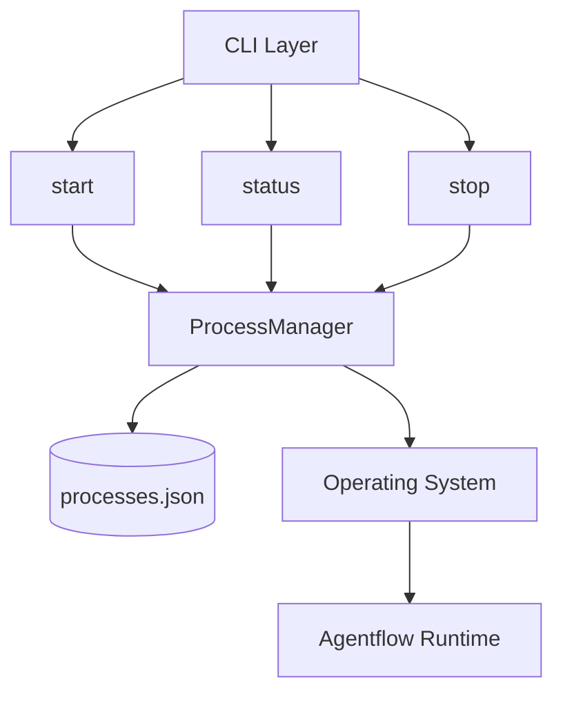
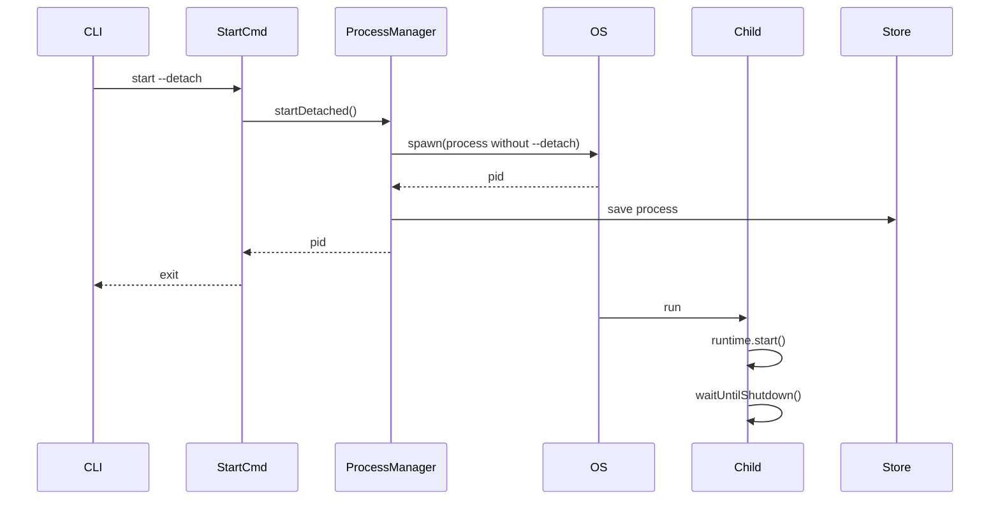
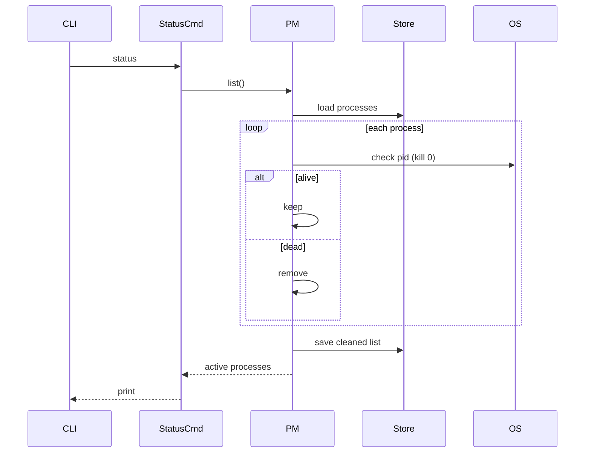
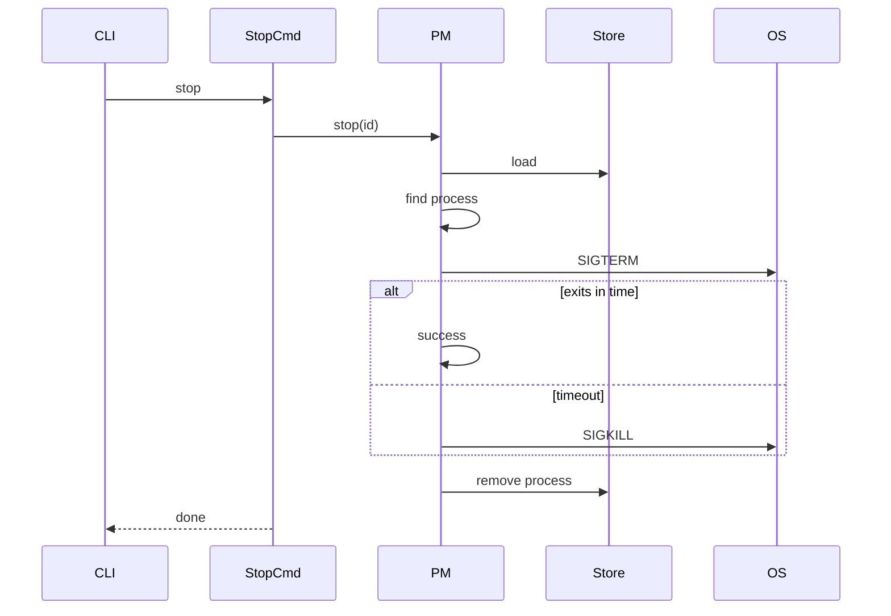
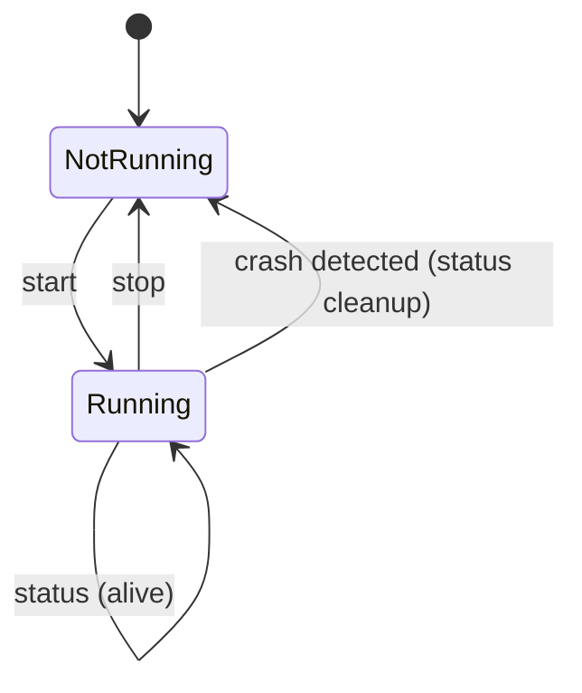

# Agentflow CLI – Process Lifecycle Management

Agentflow CLI provides a minimal process management layer for running, monitoring, and controlling the Agentflow runtime.

It supports:

* Detached process execution
* Process status inspection (self-healing)
* Graceful and forced shutdown
* Active process registry (no stale state)

---

# 🧠 Design Principles

* **Single Source of Truth** → OS (PID), not local state
* **Active State Only** → No historical/stopped entries in registry
* **Self-Healing** → Status command cleans stale processes
* **Separation of Concerns** → Runtime ≠ Process Management

---

# 🏗 High-Level Design (HLD)

## Architecture Overview



---

## Responsibilities

| Component        | Responsibility                      |
| ---------------- | ----------------------------------- |
| CLI Commands     | User interaction                    |
| ProcessManager   | Process lifecycle orchestration     |
| ProcessStore     | Persistence (active processes only) |
| OS               | Source of truth (PID lifecycle)     |
| AgentflowRuntime | Application service lifecycle       |

---

# 🔄 Command Lifecycle Flows

## Start (Detached Mode)



---

## Status (Self-Healing)



---

## Stop (Graceful → Force → Cleanup)



---

# 🔁 State Model



---

# 🧩 Low-Level Design (LLD)

## Data Model

```ts
type ProcessRecord = {
  id: string;
  pid: number;
  command: string;
  args: string[];
  startedAt: number;
};
```

> Only **active processes** are stored.

---

## ProcessStore

```ts
class ProcessStore {
  load(): ProcessRecord[]
  save(processes: ProcessRecord[]): void
  add(record: ProcessRecord): void
  remove(id: string): void
}
```

### Storage Location

```bash
~/.agentflow/processes.json
```

---

## ProcessManager

```ts
class ProcessManager {
  startDetached(args: string[]): number
  list(): ProcessRecord[]
  stop(id: string, force?: boolean): void
  private isAlive(pid: number): boolean
}
```

---

## Key Algorithms

### PID Validation

```ts
process.kill(pid, 0)
```

* does NOT kill process
* checks existence via OS

---

### Self-Healing Registry

```ts
aliveProcesses = processes.filter(isAlive)
save(aliveProcesses)
```

---

### Graceful Shutdown

```ts
SIGTERM → wait → SIGKILL (fallback)
```

---

# ⚙️ Runtime Layer

```ts
class AgentflowRuntime {
  register(service)
  start()
  stop()
}
```

### Characteristics

* In-process lifecycle only
* No knowledge of PID / registry
* Triggered via signals

---

# 📦 CLI Commands

## Start

```bash
agentflow start
agentflow start --detach
```

---

## Status

```bash
agentflow status
agentflow status --json
```

---

## Stop

```bash
agentflow stop
agentflow stop --force
agentflow stop --id <name>
```

---

# 📌 Design Guarantees

### ✅ No Stale State

* Dead processes automatically removed

### ✅ Accurate Status

* Always validated against OS

### ✅ No Uptime Drift

* Only running processes tracked

### ✅ Deterministic Lifecycle

```text
start → create
stop → remove
status → reconcile
```

---

# ⚠️ Known Limitations

### PID Reuse

OS may reuse PIDs → rare false positives

### No Multi-Instance Isolation (yet)

Currently uses:

```ts
id: "default"
```

---

# 🚀 Future Enhancements

## Process Management

* Named processes (`--name`)
* Restart command
* Health checks

## Observability

* File-based logs
* SQLite-backed logs & history

## Reliability

* PID + start-time validation
* IPC-based health checks

---

# 🧱 Suggested Folder Structure

```bash
/process
  process-manager.ts
  process-store.ts
  process-types.ts

/commands
  start.ts
  status.ts
  stop.ts

/runtime
  agentflow-runtime.ts
```

---

# 🧭 Summary

Agentflow CLI implements a **minimal, reliable process control plane**:

* ProcessManager orchestrates lifecycle
* ProcessStore persists active state
* OS is the source of truth
* Runtime executes business logic

This separation ensures the system remains **extensible, debuggable, and production-ready**.
